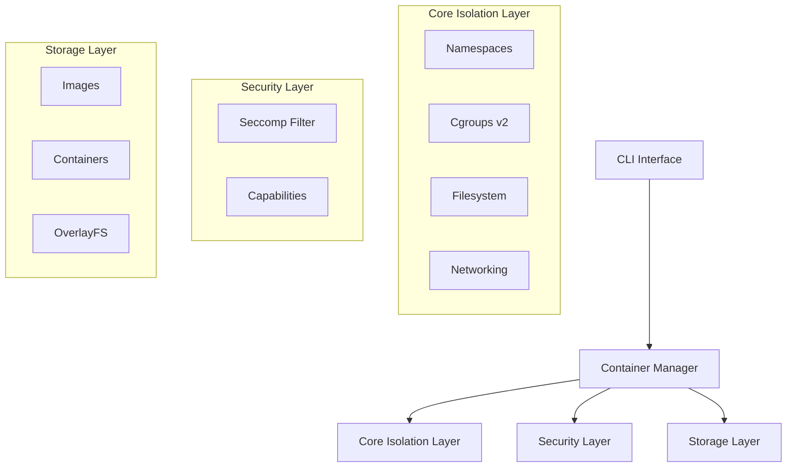

# Mini-Docker: Project Overview

## Project Overview

**Mini-Docker** is a fully functional, production-grade container runtime built from scratch in Python. It implements core Linux containerization technologies to provide process isolation, resource management, and filesystem abstraction without relying on Docker or any existing container runtime.

| Attribute | Details |
|-----------|---------|
| **Version** | 1.0.0 |
| **Language** | Python 3.12+ |
| **Platform** | Linux (x86_64) |
| **Dependencies** | None (Python stdlib + Linux syscalls only) |

---

## Table of Contents

1. [Executive Summary](#executive-summary)
2. [Architecture Overview](#architecture-overview)
3. [Core Components](#core-components)
4. [Security Model](#security-model)
5. [Installation & Setup](#installation--setup)
6. [CLI Reference](#cli-reference)
7. [API Reference](#api-reference)
8. [Technical Specifications](#technical-specifications)
9. [File Structure](#file-structure)
10. [Advanced Features](#advanced-features)

---

## Executive Summary

Mini-Docker is an educational but functional container runtime that demonstrates how modern containerization works at the Linux kernel level. It provides complete container lifecycle management including:

- **Process Isolation** via Linux namespaces (PID, UTS, Mount, IPC, Network, User)
- **Resource Limiting** via Cgroups v2 (CPU, Memory, PIDs)
- **Filesystem Isolation** via OverlayFS (with chroot fallback)
- **Security Hardening** via Seccomp syscall filtering and Linux capabilities
- **Container Networking** via veth pairs and network bridges
- **OCI Compatibility** via OCI Runtime Specification support
- **Pod Support** for shared namespace containers (Kubernetes-style)
- **Rootless Execution** for unprivileged container operation

---

## Operating Modes: Safe vs. Root

Mini-Docker supports two distinct modes of operation. Understanding the difference is critical for explaining the project's security model.

### 1. Safe Mode (Rootless) `--rootless`
**"The Educational Sandbox"**

- **Command:** `python3 -m mini_docker run --rootless ...`
- **Why use it:** Safe for shared computers, university labs, and development. It requires **zero special privileges**.
- **How it works:**
    - Uses **User Namespaces** to map your unprivileged user (UID 1000) to "Root" (UID 0) inside the container.
    - **Networking:** Restricted to localhost loopback (no internet, no bridges).
    - **Filesystem:** Falls back to `chroot` or user-owned directories.
- **Key Limit:** Cannot modify system settings (like hostname or extensive iptables rules).

### 2. Power Mode (Root) `sudo`
**"The Production Simulation"**

- **Command:** `sudo python3 -m mini_docker run ...`
- **Why use it:** To demonstrate full Linux capabilities, real networking, and strict resource limits.
- **How it works:**
    - **Networking:** Creates a real Ethernet bridge (`mini-docker0`) and uses NAT for internet access.
    - **Cgroups:** Enforces strict hardware limits (CPU quotas, Memory caps).
    - **Security:** Relies on Seccomp and Capability dropping to contain the root process.

| Feature | Safe Mode (Rootless) | Power Mode (Root) |
| :--- | :--- | :--- |
| **Privileges** | Standard User | Root / Sudo |
| **Networking** | Loopback / Localhost only | Full Bridge + NAT + Internet |
| **Resource Limits** | Best Effort | Strict Enforcement (Cgroups) |
| **Filesystem** | Local Directory | OverlayFS |
| **Risk Level** | Zero (Sandboxed) | Low (Isolated) |

---

## Architecture Overview



---

## Core Components

### 1. Namespace Management (`namespaces.py`)

Linux namespaces provide isolation for various system resources. Mini-Docker implements all six namespace types:

| Namespace | Flag | Purpose |
|-----------|------|---------|
| **PID** | `CLONE_NEWPID` | Process ID isolation (container has its own PID 1) |
| **UTS** | `CLONE_NEWUTS` | Hostname and domain name isolation |
| **Mount** | `CLONE_NEWNS` | Filesystem mount point isolation |
| **IPC** | `CLONE_NEWIPC` | Inter-process communication isolation |
| **Network** | `CLONE_NEWNET` | Network stack isolation |
| **User** | `CLONE_NEWUSER` | User/group ID isolation (rootless mode) |

**Key Functions:**
- `unshare(flags)`: Create new namespaces
- `setns(fd, nstype)`: Enter existing namespace
- `sethostname(name)`: Set container hostname

### 2. Cgroups Resource Control (`cgroups.py`)

Cgroups v2 provides resource limiting, prioritization, and accounting:

```
/sys/fs/cgroup/mini-docker/<container-id>/
├── cgroup.procs        # PIDs in this cgroup
├── cpu.max             # CPU quota (quota period)
├── memory.max          # Memory hard limit
├── memory.current      # Current memory usage
├── pids.max            # Maximum number of processes
└── io.max              # I/O bandwidth limits
```

**Supported Limits:**

| Resource | Controller | Example |
|----------|------------|---------|
| CPU | `cpu.max` | `50000 100000` = 50% of one CPU |
| Memory | `memory.max` | `104857600` = 100 MB |
| PIDs | `pids.max` | `100` = max 100 processes |

### 3. Filesystem Isolation (`filesystem.py`)

Two isolation methods are supported:

**OverlayFS (Default):**
- `lower/`: Read-only base image (from rootfs)
- `upper/`: Writable layer (container changes)
- `work/`: Working directory (OverlayFS internal)
- `merged/`: Unified view mounted for container

**Chroot (Fallback):**
- Used when OverlayFS is unavailable (e.g., restricted rootless environments).
- Provides basic directory isolation.

**Key Functions:**
- `setup_overlay_filesystem()`: Create OverlayFS layers
- `setup_pivot_root()`: Secure root filesystem swap
- `setup_chroot_filesystem()`: Basic chroot isolation

### 4. Container Networking (`network.py`)

Network architecture using veth pairs and a bridge:

```
        Host System
-----------------------------
      |          |
 [mini-docker0] (Bridge, 10.0.0.1)
      |          |
  [veth-host]  [veth-host]
      |          |
------+----------+-----------
      |          |
 [eth0 (10.0.0.2)]  [eth0 (10.0.0.3)]
   Container A        Container B
```

**Configuration:**
- Bridge: `mini-docker0` (10.0.0.1/24)
- Container IPs: 10.0.0.2 - 10.0.0.254
- NAT: `iptables` MASQUERADE for internet access

### 5. Security Components

#### Seccomp Syscall Filtering (`seccomp.py`)

**Security Model: STRICT WHITELIST APPROACH**
- Only explicitly allowed syscalls can execute
- All unlisted syscalls trigger `SECCOMP_RET_KILL_PROCESS`
- No blocklist that can be bypassed

**Allowed Syscalls (Categories):**
| Category | Examples |
|----------|----------|
| File I/O | `read`, `write`, `open`, `openat`, `close` |
| Memory | `mmap`, `mprotect`, `munmap`, `brk` |
| Process | `fork`, `clone`, `execve`, `exit` |
| Network | `socket`, `connect`, `bind`, `listen` |

**Absolutely Forbidden Syscalls:**
| Syscall | Reason |
|---------|--------|
| `ptrace` | Process tracing (container escape vector) |
| `mount` | Filesystem manipulation (privilege escalation) |
| `kexec_load` | Kernel replacement (full system compromise) |
| `init_module` | Kernel module loading (rootkit installation) |

#### Linux Capabilities (`capabilities.py`)

Capabilities break up root privileges into distinct units. Mini-Docker drops dangerous capabilities by default.

**Dropped Capabilities:**
- `CAP_SYS_ADMIN`: Broad system admin rights
- `CAP_NET_ADMIN`: Network administration
- `CAP_SYS_PTRACE`: Process tracing

---

## Security Model

Mini-Docker implements defense-in-depth security:

1.  **Layer 1: NAMESPACES** - Process, network, filesystem isolation
2.  **Layer 2: CGROUPS** - Resource usage limits
3.  **Layer 3: FILESYSTEM** - Read-only base layers
4.  **Layer 4: SECCOMP** - Kernel syscall filtering
5.  **Layer 5: CAPABILITIES** - Privilege reduction
6.  **Layer 6: NO_NEW_PRIVS** - Prevents privilege escalation via setuid binaries

---

## Installation & Setup

### Prerequisites
- Linux kernel 4.18+ (for cgroups v2)
- Python 3.7+
- Root privileges (or rootless mode setup)

### Quick Setup

```bash
# Clone the project
git clone https://github.com/Yumekaz/Mini-Docker.git
cd mini-docker

# Run setup script (requires sudo)
sudo ./setup.sh

# Build a test image (optional)
sudo python3 -m mini_docker build -t test-img .
```

### Manual Setup (for understanding internals)

```bash
# 1. Enable cgroups v2
sudo mount -t cgroup2 none /sys/fs/cgroup

# 2. Create directories
sudo mkdir -p /var/lib/mini-docker/{containers,images,overlay,pods}

# 3. Set up network bridge
sudo ip link add name mini-docker0 type bridge
sudo ip addr add 10.0.0.1/24 dev mini-docker0
sudo ip link set mini-docker0 up
```

---

## CLI Reference

### Safe Commands (Rootless)

These commands generally work without sudo, relying on user namespaces and chroot fallbacks.

```bash
# Run a container securely
python3 -m mini_docker run --rootless --name demo demo-app:v1

# Inspect a container
python3 -m mini_docker inspect demo

# Build an image
python3 -m mini_docker build -t my-app .
```

### Root Commands (Power Mode)

These require `sudo` and unleash the full power of the Linux kernel.

```bash
# Run with full networking and limits
sudo python3 -m mini_docker run --cpu 50000 --memory 128 -d nginx

# Manage network pods
sudo python3 -m mini_docker pod create web-pod
```

---

## Technical Specifications

### System Call Wrappers
Mini-Docker interfaces directly with Linux kernel via `ctypes`.

| Syscall | Module |
|---------|--------|
| `unshare(2)` | `namespaces.py` |
| `pivot_root(2)` | `filesystem.py` |
| `seccomp(2)` | `seccomp.py` |
| `prctl(2)` | `seccomp.py` |

### Container Identification
- **ID:** 12-char hex string (e.g., `a1b2c3d4e5f6`)
- **Name:** Adjective-Animal (e.g., `peaceful-penguin`)

### Data Paths
- **Root:** `/var/lib/mini-docker/` (Root) or `~/.local/share/mini-docker/` (Rootless)
- **Config:** `containers/<id>/config.json`
- **Logs:** `containers/<id>/container.log`

---

## Technical Challenges & Solutions

1.  **Rootless Permissions:**
    - Modified `utils.py` to dynamically resolve paths based on `geteuid()`.
    - Implemented graceful fallback from OverlayFS to `chroot` in `container.py` when permission errors occur.

2.  **Process Synchronization:**
    - Used `os.pipe` to synchronize the parent and child processes during namespace creation. This ensures `uid_map` is written by the parent *before* the child executes code, preventing permission denied errors.

3.  **Image Resolution:**
    - Implemented `resolve_image_path` in `image_builder.py` to allow the CLI to accept friendly names (`demo-app:v1`) instead of requiring full raw paths.

---
